# SlideCue 開發架構書

> 目的：本文件提供給開發 Agent 作為 SlideCue 系統開發依據。
> SlideCue 是一款 AI 簡報演講輔助系統，支援簡報上傳、AI 重點萃取、卡牌式重點編輯，以及基於 OpenAI Realtime Transcription API 的即時語音轉錄與主題匹配。

**最後更新**: 2026-06-02
**實作狀態**: MVP 約 96% 完成；Milestone 7 Session Report 與 Export 核心完成
**健康檢查**: ✅ 系統整體健康 ([查看報告](../reports/SYSTEM_HEALTH_CHECK_REPORT.md))

---

## 0. 目前實作快照（2026-06-02）

本段為目前程式碼的優先級最高摘要；若下方歷史段落或舊修復文件出現 `SuggestedScriptPanel`、`dynamic_script_generator.py`、`script_coverage_judge.py`、`/api/realtime-script` 等名稱，請視為歷史參考，不是現行路徑。

### 0.1 Active Presenter Flow

```text
OpenAI Realtime WebRTC transcription
  -> frontend transcript delta / completed event
  -> partial transcript matching updates Topic Cards through SSE
  -> completed transcript is saved as an Utterance
  -> Script Plan advance updates Smart Prompt cursor
  -> background Topic Matching updates card water level and child bullet coverage
```

### 0.2 智慧題詞與主題卡片依賴規則

- 智慧題詞由 `DynamicScriptPanel.tsx` + `useScriptPlan.ts` + `/api/script-plan/*` 負責。
- 主題卡片水位由 `TopicCard.tsx` + `topic_matching_engine.py` + card-state SSE 負責。
- `CARD_COVERED` / `CARD_PROBABLY_COVERED` / `CARD_LISTENING` 只更新卡片，不推進智慧題詞。
- 完整逐字稿存入後才會觸發智慧題詞 `advance`。
- 手動 `下一句` 只推進智慧題詞 cursor，不改卡片狀態。
- 重新規劃 Script Plan 時會排除已經 `covered` 的 Topic Cards。

### 0.3 模型選型

| 模組 | 目前模型 / 技術 |
|---|---|
| 投影片分析 / Topic Card 生成 | `SLIDE_ANALYSIS_MODEL=gpt-5.5` |
| 演講即時轉錄 | `REALTIME_TRANSCRIPTION_MODEL=gpt-realtime-whisper` via WebRTC |
| 演講語意判斷 / Topic Matching / Script Plan 判斷 | `SEMANTIC_UNDERSTANDING_MODEL=gpt-5.4-mini` |
| Embeddings | `text-embedding-3-large` |

### 0.4 最新驗證門檻

```bash
cd backend
DEBUG=false venv/bin/python -m compileall -q app tests
DEBUG=false venv/bin/python -m pytest -q
```

```bash
cd frontend
npm run lint
npm run build
```

---

## 1. 產品定位

**SlideCue** 是一款「AI Presentation Copilot」。

核心流程：

1. **需求確認模式**
   - 使用者上傳 PPTX。
   - 系統解析簡報內容。
   - AI 產出每頁簡報重點、Topic Cards、建議演講稿。
   - 使用者透過聊天確認報告目標、聽眾、時間長度與語氣。

2. **編輯模式**
   - 使用者看到每一頁簡報的 Topic Cards。
   - 每張卡代表該頁應該講到的一個主題。
   - 使用者可以新增、刪除、排序、編輯卡牌。
   - 每頁旁邊顯示建議演講稿。
   - **系統自動創建 PrepSession (準備模式單位)**：
     - 狀態初始為 `preparing`（黃色）
     - 分析完成後自動更新為 `ready`（綠色）

3. **演講模式 (PrepSession → PresentationSession)**
   - 一個 PrepSession 可以開啟多次 PresentationSession（重複練習）
   - 使用 OpenAI Realtime API 即時收音與轉寫。
   - 系統判斷使用者是否講到某張 Topic Card。
   - 已講到的卡牌消失或打勾。
   - 若使用者跳過重要主題，卡牌以紅色提示。
   - 每次簡報記錄獨立保存，便於追蹤練習進度。

---

## 1.1 指定技術棧

本專案固定使用以下技術棧開發：

| 層級 | 技術 | 實際版本 | 狀態 |
|---|---|---|---|
| Frontend | React + TypeScript | React 18.3.1, TS 5.9.3 | ✅ |
| Build Tool | Vite | 5.4.21 | ✅ |
| UI Styling | Tailwind CSS | 3.4.19 | ✅ |
| State Management | Zustand | 4.5.7 | ✅ |
| Backend API | Python + FastAPI | Python 3.11.15, FastAPI 0.109.2 | ✅ |
| ORM | SQLAlchemy | 2.0.27 | ✅ |
| Validation | Pydantic | 2.6.1 | ✅ |
| Worker | Celery + Redis | Celery 5.3.6, Redis 5.0.1 | ✅ |
| Queue / Runtime Cache | Redis | 7-alpine | ✅ |
| Database | PostgreSQL + pgvector | PostgreSQL 16 | ✅ |
| Object Storage | S3-compatible (MinIO) | MinIO latest | ✅ |
| Vector Store | pgvector | Extension installed | ✅ |
| AI - PPT Analysis | OpenAI Responses API | OpenAI SDK 1.51.0 | ✅ |
| AI - Speech Transcription | **OpenAI Realtime Transcription API** | gpt-realtime-whisper via WebRTC | ✅ |
| AI - Backend Semantic | GPT-5.4-mini | OpenAI SDK 1.51.0 | ✅ |
| AI - Embedding | text-embedding-3-large | OpenAI SDK 1.51.0 | ✅ |

### ✅ 語音轉錄技術實作

**採用技術**: OpenAI Realtime Transcription API (WebRTC)
**轉錄模型**: gpt-realtime-whisper

**技術特點**:
- ✅ **WebRTC 直連 OpenAI**: 瀏覽器麥克風直接串流至 OpenAI，低延遲
- ✅ **Server-side VAD**: 伺服器端語音活動檢測，自動識別說話/靜音
- ✅ **即時轉錄串流**: 透過 data channel 接收即時 transcript delta 與 completed events
- ✅ **繁體中文優化**: 支援語言指定與自訂 prompt 引導
- ✅ **Ephemeral Token 安全機制**: 後端產生短期 token，前端不持有 API key
- ✅ **事件驅動架構**: 透過 WebRTC data channel 傳輸結構化事件

**實作架構**:
```
Frontend → 後端請求 ephemeral token
       → 建立 WebRTC PeerConnection
       → 直接連線 OpenAI Realtime API
       → 接收即時轉錄事件
       → POST transcript 至後端進行主題匹配
```

開發 Agent 請依此技術棧實作，不要改用 Next.js、NestJS 或其他後端框架，除非使用者明確要求更改。

---

## 2. 核心架構原則

### 2.1 重要設計判斷

SlideCue 應拆成兩種 AI 流程：

| 流程 | 使用技術 | 目的 | 狀態 |
|---|---|---|---|
| 批次簡報理解 | OpenAI Responses API | 分析 PPT/PDF、產生 Topic Cards 與講稿 | ✅ 已實作 |
| 即時演講監聽 | **OpenAI Realtime Transcription API** | WebRTC 即時收音、語音轉文字 | ✅ 已實作 |
| 語義理解與匹配 | GPT-5.4-mini + Embeddings | 判斷講者是否覆蓋主題 | ✅ 已實作 |

**語音轉錄實作方式**:

**採用**: OpenAI Realtime Transcription API (WebRTC) + gpt-realtime-whisper 模型

**架構流程**:
1. 前端向後端請求 **ephemeral token**（短期 WebRTC 連線憑證）
2. 前端使用 `getUserMedia` 取得麥克風權限
3. 前端建立 **RTCPeerConnection** 直接連線至 OpenAI Realtime API
4. 音訊透過 WebRTC 即時串流至 OpenAI
5. OpenAI 執行 **server-side VAD**（語音活動檢測）自動判斷說話/靜音
6. OpenAI 透過 data channel 回傳即時轉錄事件：
   - `input_audio_buffer.speech_started` - 開始說話
   - `conversation.item.input_audio_transcription.delta` - 即時轉錄片段
   - `conversation.item.input_audio_transcription.completed` - 完整轉錄結果
7. 前端收到完整 transcript 後，POST 至後端進行主題匹配
8. 後端使用 GPT-5.4-mini + Embeddings 判斷主題覆蓋

**優勢**:
- ✅ 低延遲（WebRTC 直連）
- ✅ 即時串流轉錄（無需等待完整音檔）
- ✅ Server-side VAD（自動偵測說話區間）
- ✅ 安全性高（ephemeral token 機制）
- ✅ 繁體中文支援（語言指定 + 自訂 prompt）

**不要讓語音 API 負責 PPT 解析。** PPT 解析與卡牌生成由後端 worker 使用 Responses API 完成。

### 2.2 PPTX 處理原則

OpenAI 文件指出：非 PDF 檔案不會把內嵌圖片與圖表抽入模型上下文。
因此 SlideCue 後端應先將 PPTX 轉成 PDF，再交給模型分析。

建議流程：

```text
PPTX → PDF → slide images → text extraction → AI analysis
```

### 2.3 演講偵測原則

不要只用關鍵字比對。

應使用三層比對：

1. Semantic Similarity：語意相似度
2. Keyword Coverage：關鍵字命中率
3. Fact Coverage：必講事實覆蓋率

建議公式：

```text
finalScore =
  semanticScore * 0.55 +
  keywordScore * 0.25 +
  factScore * 0.20
```


### 2.4 演講模式語意理解模型指定

在 **演講模式** 中，後端處理語意理解與卡牌覆蓋判斷的模型指定為：

```text
SEMANTIC_UNDERSTANDING_MODEL = gpt-5.4-mini
```

設計分工如下：

| 模組 | 模型 / 技術 | 職責 |
|---|---|---|
| Browser Realtime Client | WebRTC | 收音與事件傳輸 |
| OpenAI Realtime Transcription | Realtime transcription model | 即時語音轉文字，產生 transcript delta / completed events |
| Backend Topic Matching Engine | GPT-5.4-mini | 判斷 transcript 是否語意上覆蓋某張 Topic Card |
| Embedding Model | Embeddings | 快速召回候選卡片、計算語意相似度 |
| Rule-based Scoring | Keyword / Fact / Threshold | 提供可解釋、可測試的分數與狀態轉移 |

重要原則：

1. Realtime 不直接決定卡牌是否 covered。
2. Realtime 只提供語音輸入與 transcript events。
3. 後端 Topic Matching Engine 使用 GPT-5.4-mini 對 transcript 與候選 Topic Cards 做語意理解。
4. GPT-5.4-mini 必須輸出結構化 JSON，不能直接回傳自然語言作為判定結果。
5. GPT-5.4-mini 的判定結果仍需通過 threshold、狀態機與 evidence 保存流程。
6. MVP 階段只對「目前 slide」的 pending / probably_covered / at_risk cards 做 GPT-5.4-mini 判斷。

建議採用兩階段 matching：

```text
Stage 1: Embedding / keyword / fact 快速篩選候選 cards
Stage 2: GPT-5.4-mini 對候選 cards 做語意覆蓋判斷
```

這樣可以兼顧速度、成本與準確度。


---

## 3. 完整系統架構圖

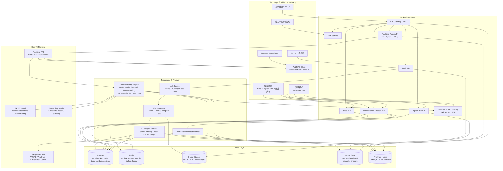

---

## 4. 技術分層

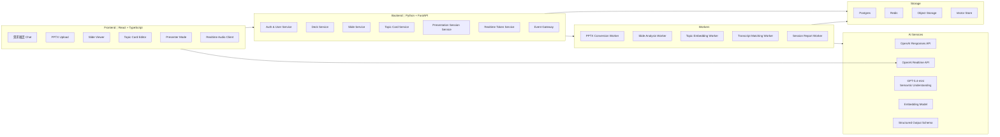

---

## 5. 需求確認模式：PPT 分析流程

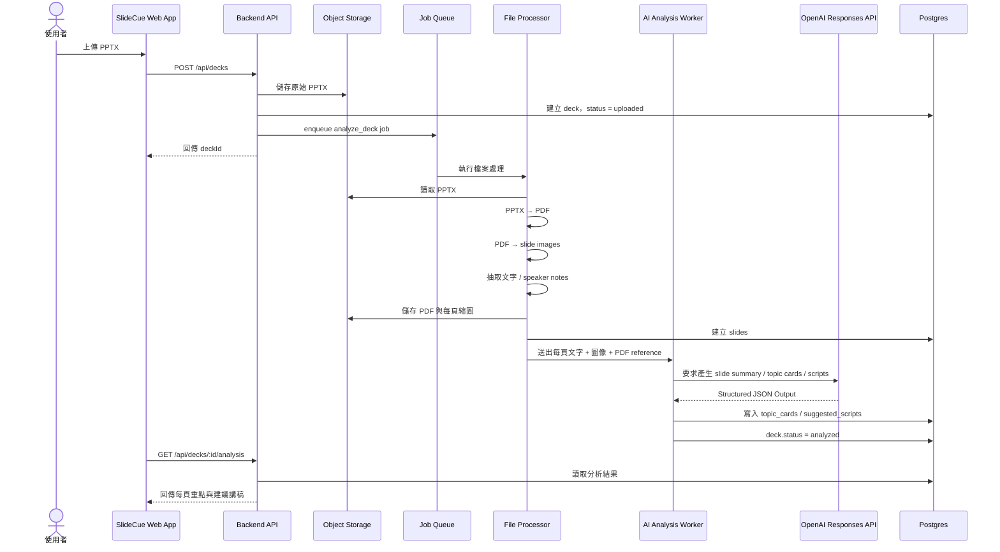

---

## 6. 編輯模式架構

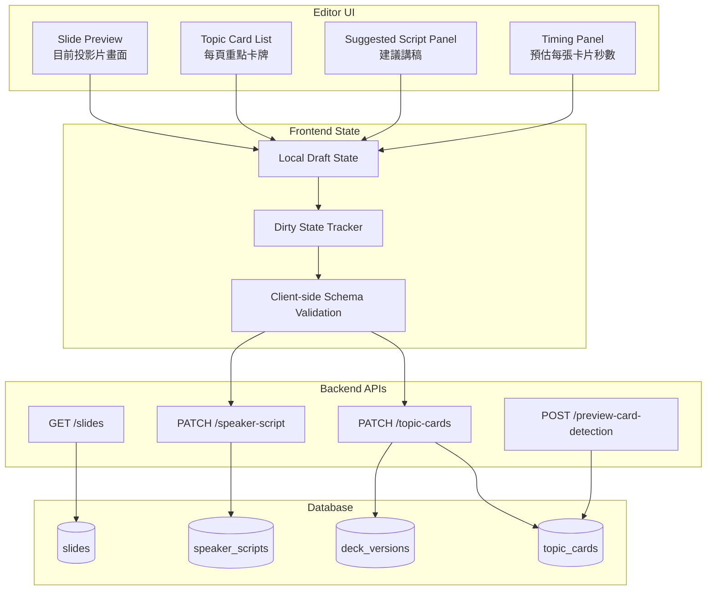

---

## 7. 演講模式架構

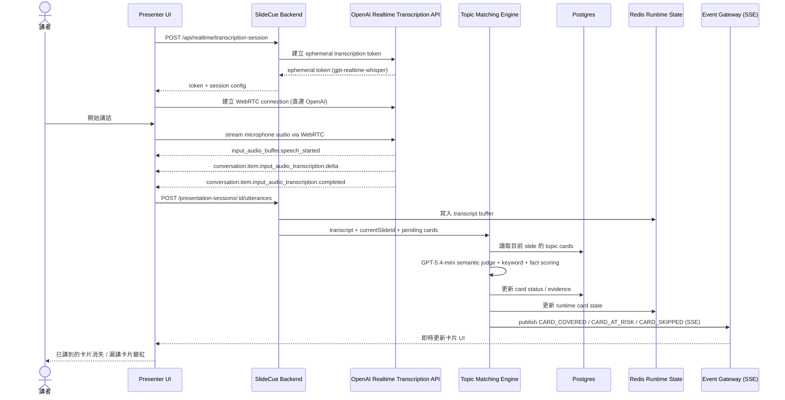

---

## 7.1 PrepSession 架構：準備模式與簡報模式分離

**設計理念**：
將「準備階段」與「實際簡報」分離為兩層架構，一個準備單位可包含多次練習記錄。

### 架構層級

```
Deck (投影片檔案)
  └─ PrepSession (準備模式單位) - 可有多個
       ├─ 狀態：preparing → ready → archived
       ├─ 創建時機：進入編輯模式時自動創建
       └─ PresentationSession (簡報記錄) - 可重複多次
            ├─ 每次開始簡報創建新記錄
            ├─ 包含：utterances, card_states, 時長等
            └─ 用途：追蹤練習進度、比較表現
```

### PrepSession 生命週期

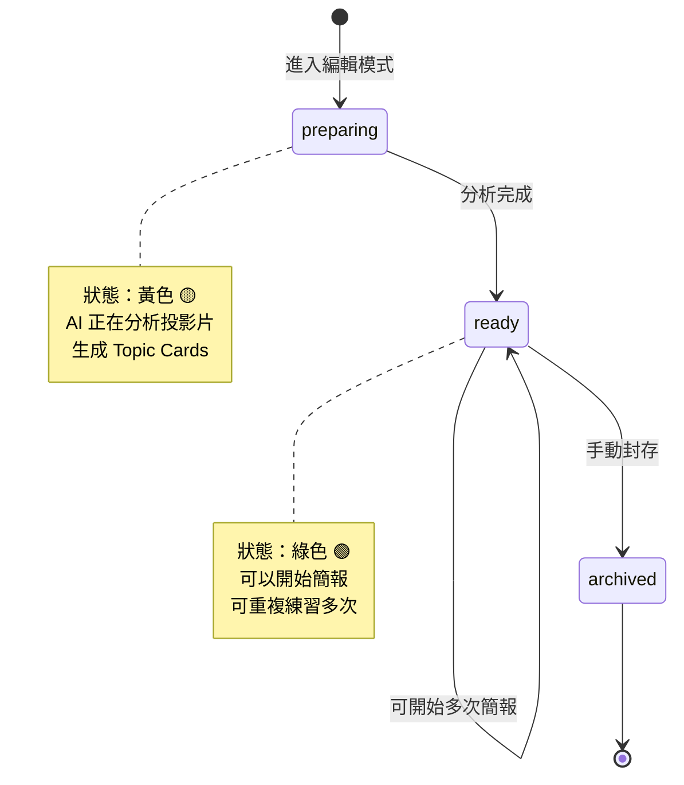

### 自動狀態管理

**創建時機**（Frontend）:
```typescript
// EditorPage.tsx - 進入編輯模式時
useEffect(() => {
  // 自動創建 PrepSession（狀態：preparing）
  await prepSessionsAPI.createPrepSession({
    deckId: deckId,
    title: `${deck.title} - Prep Session`
  })
}, [deckId])
```

**狀態更新**（Backend）:
```python
# slide_analysis_worker.py - 分析完成後
def analyze_slides(deck_id: str):
    # ... 分析投影片 ...

    deck.status = "analyzed"
    db.commit()

    # 自動更新相關 PrepSession 為 ready
    prep_sessions = db.query(PrepSession).filter(
        PrepSession.deck_id == deck_id,
        PrepSession.status == "preparing"
    ).all()

    for prep in prep_sessions:
        prep.status = "ready"
        prep.updated_at = datetime.utcnow()

    db.commit()
```

### API 端點

```python
# PrepSession 管理
GET    /api/prep-sessions/              # 列出所有準備模式
POST   /api/prep-sessions/              # 創建準備模式
GET    /api/prep-sessions/{id}          # 取得單個準備模式
PATCH  /api/prep-sessions/{id}          # 更新狀態/標題
DELETE /api/prep-sessions/{id}          # 刪除（cascade）
DELETE /api/prep-sessions/all           # 刪除所有

# PrepSession 下的 PresentationSession
GET    /api/prep-sessions/{id}/presentation-sessions  # 列出所有簡報記錄
POST   /api/prep-sessions/{id}/presentation-sessions  # 開始新簡報
```

### 資料庫關係

```sql
prep_sessions (準備模式)
  ├─ id: TEXT PRIMARY KEY
  ├─ deck_id: TEXT REFERENCES decks(id)
  ├─ status: TEXT (preparing/ready/archived)
  ├─ title: TEXT (可自訂)
  └─ presentation_sessions[] (多個簡報記錄)

presentation_sessions (簡報記錄)
  ├─ id: TEXT PRIMARY KEY
  ├─ prep_session_id: TEXT REFERENCES prep_sessions(id)
  ├─ deck_id: TEXT REFERENCES decks(id)
  ├─ status: TEXT (idle/presenting/ended...)
  ├─ started_at: TIMESTAMPTZ
  ├─ ended_at: TIMESTAMPTZ
  └─ utterances[], card_states[]
```

### 前端頁面

**PrepSession 管理頁面** (`/prep-sessions`):
- 顯示所有準備模式（可展開查看簡報記錄）
- 狀態視覺化：preparing 🟡, ready 🟢
- 統計資料：總準備模式數、簡報次數
- 操作：刪除單個、刪除所有

---

## 8. Topic Matching Engine

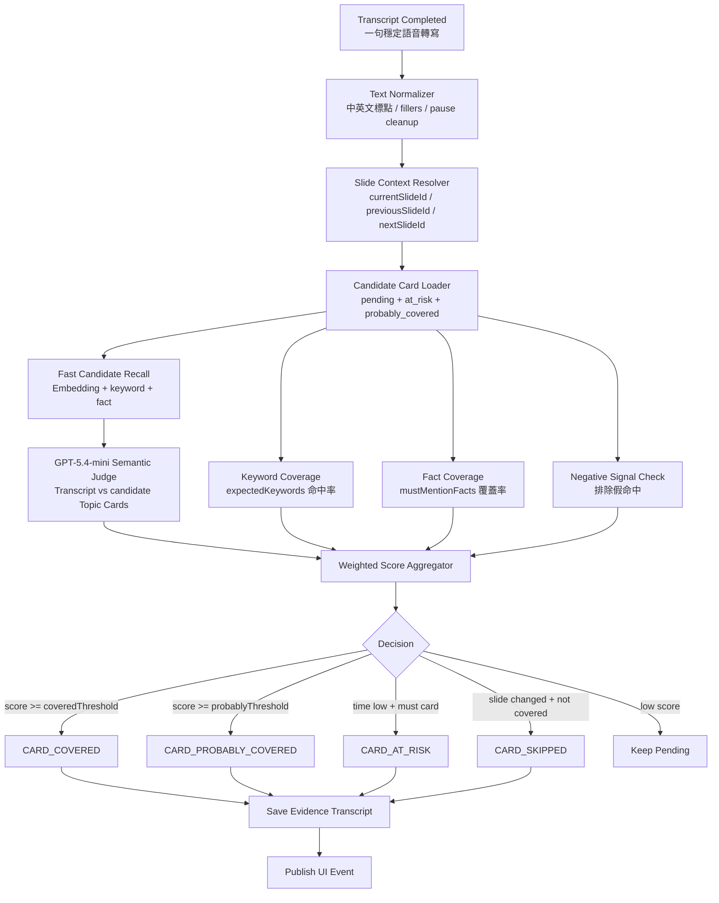

---

## 9. Topic Card JSON Schema

```json
{
  "$schema": "https://json-schema.org/draft/2020-12/schema",
  "$id": "https://slidecue.app/schemas/topic-card.schema.json",
  "title": "TopicCard",
  "type": "object",
  "required": [
    "id",
    "deckId",
    "slideId",
    "slidePageNumber",
    "title",
    "description",
    "importance",
    "coverageRule",
    "suggestedScript",
    "estimatedSeconds",
    "orderIndex",
    "status"
  ],
  "properties": {
    "id": {
      "type": "string"
    },
    "deckId": {
      "type": "string"
    },
    "slideId": {
      "type": "string"
    },
    "slidePageNumber": {
      "type": "integer",
      "minimum": 1
    },
    "title": {
      "type": "string",
      "minLength": 1,
      "maxLength": 80
    },
    "description": {
      "type": "string",
      "minLength": 1,
      "maxLength": 500
    },
    "importance": {
      "type": "string",
      "enum": ["must", "should", "optional"]
    },
    "topicType": {
      "type": "string",
      "enum": [
        "opening",
        "problem",
        "insight",
        "data",
        "solution",
        "feature",
        "benefit",
        "comparison",
        "risk",
        "result",
        "transition",
        "closing",
        "custom"
      ],
      "default": "custom"
    },
    "coverageRule": {
      "$ref": "#/$defs/CoverageRule"
    },
    "suggestedScript": {
      "type": "string",
      "maxLength": 2000
    },
    "shortPrompt": {
      "type": "string",
      "maxLength": 240
    },
    "estimatedSeconds": {
      "type": "integer",
      "minimum": 5,
      "maximum": 300
    },
    "orderIndex": {
      "type": "integer",
      "minimum": 0
    },
    "status": {
      "type": "string",
      "enum": [
        "pending",
        "listening",
        "probably_covered",
        "covered",
        "at_risk",
        "skipped",
        "manually_checked",
        "disabled"
      ],
      "default": "pending"
    },
    "confidence": {
      "type": "number",
      "minimum": 0,
      "maximum": 1
    },
    "evidence": {
      "$ref": "#/$defs/CoverageEvidence"
    },
    "ui": {
      "$ref": "#/$defs/CardUI"
    },
    "createdBy": {
      "type": "string",
      "enum": ["ai", "user", "system"],
      "default": "ai"
    },
    "createdAt": {
      "type": "string",
      "format": "date-time"
    },
    "updatedAt": {
      "type": "string",
      "format": "date-time"
    }
  },
  "$defs": {
    "CoverageRule": {
      "type": "object",
      "required": [
        "semanticAnchors",
        "expectedKeywords",
        "mustMentionFacts",
        "thresholds"
      ],
      "properties": {
        "semanticAnchors": {
          "type": "array",
          "minItems": 1,
          "maxItems": 8,
          "items": {
            "type": "string",
            "maxLength": 300
          }
        },
        "expectedKeywords": {
          "type": "array",
          "maxItems": 20,
          "items": {
            "type": "string",
            "maxLength": 50
          }
        },
        "mustMentionFacts": {
          "type": "array",
          "maxItems": 10,
          "items": {
            "$ref": "#/$defs/MustMentionFact"
          }
        },
        "negativeSignals": {
          "type": "array",
          "maxItems": 10,
          "items": {
            "type": "string",
            "maxLength": 200
          }
        },
        "thresholds": {
          "type": "object",
          "required": [
            "probablyCovered",
            "covered"
          ],
          "properties": {
            "probablyCovered": {
              "type": "number",
              "minimum": 0,
              "maximum": 1,
              "default": 0.62
            },
            "covered": {
              "type": "number",
              "minimum": 0,
              "maximum": 1,
              "default": 0.78
            }
          }
        },
        "scoringWeights": {
          "type": "object",
          "properties": {
            "semanticSimilarity": {
              "type": "number",
              "minimum": 0,
              "maximum": 1,
              "default": 0.55
            },
            "keywordCoverage": {
              "type": "number",
              "minimum": 0,
              "maximum": 1,
              "default": 0.25
            },
            "factCoverage": {
              "type": "number",
              "minimum": 0,
              "maximum": 1,
              "default": 0.2
            }
          }
        }
      }
    },
    "MustMentionFact": {
      "type": "object",
      "required": ["text", "required"],
      "properties": {
        "text": {
          "type": "string",
          "maxLength": 200
        },
        "required": {
          "type": "boolean",
          "default": true
        },
        "aliases": {
          "type": "array",
          "items": {
            "type": "string",
            "maxLength": 100
          }
        }
      }
    },
    "CoverageEvidence": {
      "type": "object",
      "properties": {
        "matchedUtteranceIds": {
          "type": "array",
          "items": {
            "type": "string"
          }
        },
        "matchedTranscript": {
          "type": "string",
          "maxLength": 2000
        },
        "matchedAt": {
          "type": "string",
          "format": "date-time"
        },
        "semanticScore": {
          "type": "number",
          "minimum": 0,
          "maximum": 1
        },
        "keywordScore": {
          "type": "number",
          "minimum": 0,
          "maximum": 1
        },
        "factScore": {
          "type": "number",
          "minimum": 0,
          "maximum": 1
        },
        "finalScore": {
          "type": "number",
          "minimum": 0,
          "maximum": 1
        }
      }
    },
    "CardUI": {
      "type": "object",
      "properties": {
        "color": {
          "type": "string",
          "enum": ["default", "green", "yellow", "red", "gray"],
          "default": "default"
        },
        "isVisible": {
          "type": "boolean",
          "default": true
        },
        "isPinned": {
          "type": "boolean",
          "default": false
        },
        "displayMode": {
          "type": "string",
          "enum": ["full", "compact", "hidden"],
          "default": "full"
        }
      }
    }
  }
}
```

---

## 10. Topic Card 範例

```json
{
  "id": "card_01HZT8A9R6N3",
  "deckId": "deck_01HZT7M2P9Q1",
  "slideId": "slide_003",
  "slidePageNumber": 3,
  "title": "市場痛點：簡報練習缺乏即時回饋",
  "description": "說明目前使用者在練習簡報時，通常不知道自己是否漏講重點，也缺乏即時提醒。",
  "importance": "must",
  "topicType": "problem",
  "coverageRule": {
    "semanticAnchors": [
      "現在使用者練習簡報時，很難知道自己有沒有漏掉重點。",
      "傳統簡報練習缺少即時回饋，只能事後自己回想或請別人幫忙看。",
      "講者需要一個能在演講當下提醒他是否講到重點的工具。"
    ],
    "expectedKeywords": [
      "簡報練習",
      "即時回饋",
      "漏講",
      "重點",
      "提醒"
    ],
    "mustMentionFacts": [
      {
        "text": "使用者可能會漏講重要主題",
        "required": true,
        "aliases": [
          "忘記講重點",
          "跳過重要內容",
          "沒有提到關鍵資訊"
        ]
      }
    ],
    "negativeSignals": [
      "這不是一個問題",
      "使用者不需要回饋"
    ],
    "thresholds": {
      "probablyCovered": 0.62,
      "covered": 0.78
    },
    "scoringWeights": {
      "semanticSimilarity": 0.55,
      "keywordCoverage": 0.25,
      "factCoverage": 0.2
    }
  },
  "suggestedScript": "這一頁我想先說明目前簡報練習的痛點。很多人在練習時，其實不知道自己有沒有把每一頁該講的重點講完整，尤其在正式報告時，一緊張就很容易跳過重要內容。所以我們希望做一個能在演講過程中即時提醒講者的簡報幫手。",
  "shortPrompt": "強調：練習簡報時容易漏講重點，缺乏即時回饋。",
  "estimatedSeconds": 35,
  "orderIndex": 0,
  "status": "pending",
  "confidence": 0,
  "ui": {
    "color": "default",
    "isVisible": true,
    "isPinned": false,
    "displayMode": "full"
  },
  "createdBy": "ai",
  "createdAt": "2026-05-22T10:00:00+08:00",
  "updatedAt": "2026-05-22T10:00:00+08:00"
}
```

---

## 11. 演講 Session 狀態機

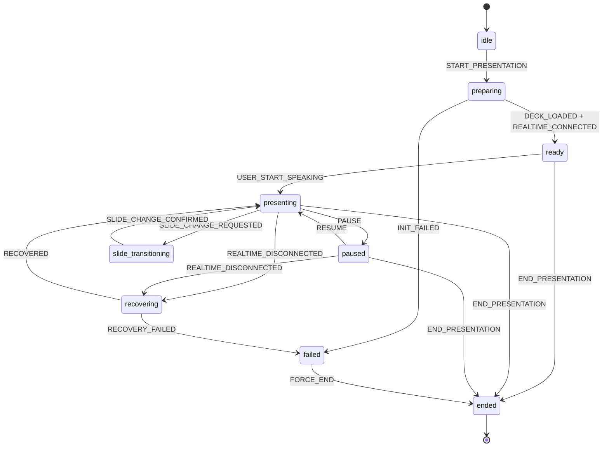

### Session 狀態定義

| 狀態 | 說明 |
|---|---|
| `idle` | 尚未開始演講 |
| `preparing` | 建立 Realtime session、載入簡報與卡牌 |
| `ready` | 麥克風與 Realtime 連線已準備好 |
| `presenting` | 使用者正在演講 |
| `paused` | 暫停收音或暫停判斷 |
| `slide_transitioning` | 使用者切換簡報頁面中 |
| `recovering` | Realtime 或網路中斷，嘗試恢復 |
| `ended` | 演講結束 |
| `failed` | 發生無法恢復的錯誤 |

---

## 12. Topic Card 狀態機

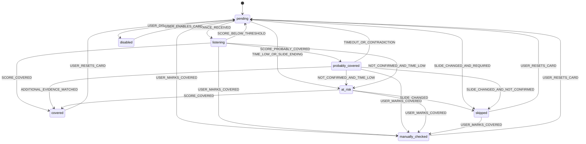

### Topic Card 狀態定義

| 狀態 | UI 表現 | 說明 |
|---|---|---|
| `pending` | 一般卡片 | 尚未被講到 |
| `listening` | 輕微高亮 | 系統正在比對這張卡 |
| `probably_covered` | 淡綠或黃色 | 可能已講到，但信心不足 |
| `covered` | 綠色、打勾、淡出 | 確認已講到 |
| `at_risk` | 橘色或淡紅 | 時間快不夠或即將換頁，但還沒講到 |
| `skipped` | 紅色 | 換頁後仍未講到的重要卡 |
| `manually_checked` | 綠色 + 手動標記 icon | 使用者手動確認 |
| `disabled` | 灰色 | 不參與偵測 |

---

## 13. React 前端建議目錄結構

```text
src/
  main.tsx
  App.tsx
  routes/
    DeckUploadPage.tsx
    DeckAnalysisPage.tsx
    EditorPage.tsx
    PresenterPage.tsx
    SessionReportPage.tsx
  components/
    upload/
      PptxUploader.tsx
    editor/
      SlidePreview.tsx
      TopicCardList.tsx
      TopicCardEditor.tsx
      DynamicScriptPanel.tsx
    presenter/
      PresenterView.tsx
      RealtimeTranscriptPanel.tsx
      RuntimeTopicCard.tsx
      SlideNavigation.tsx
  hooks/
    useRealtimeSession.ts
    usePresentationSession.ts
    useTopicCards.ts
  stores/
    deckStore.ts
    editorStore.ts
    presentationStore.ts
  api/
    client.ts
    decks.ts
    slides.ts
    topicCards.ts
    realtime.ts
    presentationSessions.ts
  types/
    topicCard.ts
    presentation.ts
    matching.ts
```

React 開發規則：

1. 所有 API 型別與後端 Pydantic schemas 對齊。
2. Presenter Mode 的即時狀態使用 store 管理，不要散落在多個 component local state。
3. WebRTC 連線邏輯封裝在 `useRealtimeSession.ts`。
4. 卡牌狀態 UI 必須只根據後端 event / reducer 結果更新。
5. 前端可以 optimistic update 編輯模式，但演講模式的 covered / skipped / at_risk 以後端事件為準。

## 14. 前端 Runtime State

```ts
type PresentationRuntimeState = {
  sessionId: string;
  deckId: string;
  status:
    | "idle"
    | "preparing"
    | "ready"
    | "presenting"
    | "paused"
    | "slide_transitioning"
    | "recovering"
    | "ended"
    | "failed";

  currentSlideId: string;
  currentSlidePageNumber: number;

  slideStartedAt: string | null;
  elapsedSecondsOnSlide: number;
  estimatedSecondsOnSlide: number;

  cardsBySlideId: Record<string, TopicCard[]>;

  realtime: {
    connectionStatus:
      | "disconnected"
      | "connecting"
      | "connected"
      | "reconnecting"
      | "failed";

    lastEventAt: string | null;
    lastTranscriptDelta: string;
  };

  utterances: {
    id: string;
    slideId: string;
    transcript: string;
    startedAt: string;
    endedAt: string;
  }[];
};
```

---

## 15. Matching Engine 介面

```ts
type MatchTopicCardsInput = {
  sessionId: string;
  slideId: string;
  utteranceId: string;
  transcript: string;
  topicCards: TopicCard[];
};

type MatchTopicCardsOutput = {
  sessionId: string;
  slideId: string;
  utteranceId: string;
  transcript: string;
  matches: {
    topicCardId: string;
    semanticScore: number;
    keywordScore: number;
    factScore: number;
    finalScore: number;
    decision: "no_match" | "probably_covered" | "covered";
    reason: string;
  }[];
};
```


### 15.1 GPT-5.4-mini Semantic Judge 輸入

```ts
type SemanticJudgeInput = {
  sessionId: string;
  slideId: string;
  utterance: {
    id: string;
    transcript: string;
    startedAt?: string;
    endedAt?: string;
  };
  candidateCards: {
    id: string;
    title: string;
    description: string;
    importance: "must" | "should" | "optional";
    semanticAnchors: string[];
    expectedKeywords: string[];
    mustMentionFacts: {
      text: string;
      required: boolean;
      aliases?: string[];
    }[];
    currentStatus:
      | "pending"
      | "listening"
      | "probably_covered"
      | "at_risk";
  }[];
};
```

### 15.2 GPT-5.4-mini Semantic Judge 輸出

GPT-5.4-mini 必須輸出以下 JSON，不可輸出額外自然語言：

```ts
type SemanticJudgeOutput = {
  sessionId: string;
  slideId: string;
  utteranceId: string;
  decisions: {
    topicCardId: string;
    semanticCoverage:
      | "not_covered"
      | "partially_covered"
      | "covered";
    semanticScore: number;
    coveredFacts: string[];
    missingFacts: string[];
    evidenceQuote: string;
    reason: string;
  }[];
};
```

### 15.3 GPT-5.4-mini 判斷提示詞原則

後端呼叫 GPT-5.4-mini 時，system prompt 應固定要求：

```text
你是 SlideCue 的演講語意判斷器。
你的任務是判斷使用者剛剛說的一段 transcript，是否語意上覆蓋候選 Topic Cards。
不要因為出現單一關鍵字就判定 covered。
如果只講到一部分，請標示 partially_covered。
如果 transcript 沒有表達該 topic 的核心意思，請標示 not_covered。
請只輸出符合 JSON schema 的結果，不要輸出自然語言說明。
```

### 15.4 後端決策規則

GPT-5.4-mini 的 `semanticScore` 不直接等於最終結果，仍須與 keywordScore、factScore 加權：

```text
finalScore =
  semanticScore * 0.55 +
  keywordScore * 0.25 +
  factScore * 0.20
```

決策：

| 條件 | decision |
|---|---|
| finalScore >= 0.78 且 semanticCoverage = covered | `covered` |
| finalScore >= 0.62 或 semanticCoverage = partially_covered | `probably_covered` |
| finalScore < 0.62 | `no_match` |


---

## 16. API 草案

以下 API 由 FastAPI 實作；本清單以 `backend/app/main.py` 目前實際掛載為準：

```text
/api/auth
/api/decks
/api/slides
/api/topic-cards
/api/events
/api/realtime
/api/prep-sessions
/api/presentation-sessions
/api/script-plan
```

建議 FastAPI app entry：

```py
# app/main.py
from fastapi import FastAPI
from app.api.routes import (
  auth, decks, slides, topic_cards, events, realtime,
  prep_sessions, presentation_sessions, script_plan,
  session_reports,
)

app = FastAPI(title="SlideCue API")

app.include_router(auth.router, prefix="/api/auth", tags=["auth"])
app.include_router(decks.router, prefix="/api/decks", tags=["decks"])
app.include_router(slides.router, prefix="/api/slides", tags=["slides"])
app.include_router(topic_cards.router, prefix="/api/topic-cards", tags=["topic-cards"])
app.include_router(events.router, prefix="/api/events", tags=["events"])
app.include_router(realtime.router, prefix="/api/realtime", tags=["realtime"])
app.include_router(prep_sessions.router, prefix="/api/prep-sessions", tags=["prep-sessions"])
app.include_router(
    presentation_sessions.router,
    prefix="/api/presentation-sessions",
    tags=["presentation-sessions"],
)
app.include_router(script_plan.router, prefix="/api/script-plan", tags=["script-plan"])
app.include_router(session_reports.router, prefix="/api/presentation-sessions", tags=["session-reports"])
```

### Deck

```http
POST /api/decks
GET /api/decks/:deckId
GET /api/decks/:deckId/analysis
DELETE /api/decks/:deckId
```

### Slide

```http
GET /api/decks/:deckId/slides
GET /api/slides/:slideId
PATCH /api/slides/:slideId
```

### Topic Cards

```http
GET /api/slides/:slideId/topic-cards
POST /api/slides/:slideId/topic-cards
PATCH /api/topic-cards/:topicCardId
PATCH /api/slides/:slideId/topic-cards/reorder
DELETE /api/topic-cards/:topicCardId
```

### Realtime

```http
POST /api/realtime/session
POST /api/realtime/transcription-session
```

用途：
後端用正式 OpenAI API Key 建立 ephemeral token，再回傳給前端 WebRTC client。

### Presentation Session

```http
POST /api/presentation-sessions
GET /api/presentation-sessions/:sessionId
PATCH /api/presentation-sessions/:sessionId/current-slide
POST /api/presentation-sessions/:sessionId/utterances
POST /api/presentation-sessions/:sessionId/end
GET /api/presentation-sessions/:sessionId/events
```

`GET /events` 可使用 SSE 或 WebSocket。

### Session Report

```http
POST /api/presentation-sessions/:sessionId/report
GET /api/presentation-sessions/:sessionId/report/coverage
GET /api/presentation-sessions/:sessionId/report/timeline
GET /api/presentation-sessions/:sessionId/report/topics
POST /api/presentation-sessions/:sessionId/report/export/json
POST /api/presentation-sessions/:sessionId/report/export/pdf
```

目前核心分析報告與 PDF/JSON export 已實作；export 檔案會上傳至 MinIO/S3，並回傳 presigned download URL。

---

## 17. Database Schema 初稿

```sql
CREATE TABLE users (
  id TEXT PRIMARY KEY,
  email TEXT NOT NULL UNIQUE,
  created_at TIMESTAMPTZ NOT NULL DEFAULT now()
);

CREATE TABLE decks (
  id TEXT PRIMARY KEY,
  user_id TEXT NOT NULL REFERENCES users(id),
  title TEXT NOT NULL,
  source_file_url TEXT NOT NULL,
  pdf_file_url TEXT,
  status TEXT NOT NULL,
  created_at TIMESTAMPTZ NOT NULL DEFAULT now(),
  updated_at TIMESTAMPTZ NOT NULL DEFAULT now()
);

CREATE TABLE slides (
  id TEXT PRIMARY KEY,
  deck_id TEXT NOT NULL REFERENCES decks(id),
  page_number INTEGER NOT NULL,
  title TEXT,
  image_url TEXT,
  extracted_text TEXT,
  speaker_notes TEXT,
  ai_summary TEXT,
  created_at TIMESTAMPTZ NOT NULL DEFAULT now()
);

CREATE TABLE topic_cards (
  id TEXT PRIMARY KEY,
  deck_id TEXT NOT NULL REFERENCES decks(id),
  slide_id TEXT NOT NULL REFERENCES slides(id),
  slide_page_number INTEGER NOT NULL,
  title TEXT NOT NULL,
  description TEXT NOT NULL,
  importance TEXT NOT NULL,
  topic_type TEXT NOT NULL DEFAULT 'custom',
  coverage_rule JSONB NOT NULL,
  suggested_script TEXT,
  short_prompt TEXT,
  estimated_seconds INTEGER NOT NULL DEFAULT 30,
  order_index INTEGER NOT NULL DEFAULT 0,
  status TEXT NOT NULL DEFAULT 'pending',
  confidence NUMERIC(4,3) DEFAULT 0,
  ui JSONB,
  created_by TEXT NOT NULL DEFAULT 'ai',
  created_at TIMESTAMPTZ NOT NULL DEFAULT now(),
  updated_at TIMESTAMPTZ NOT NULL DEFAULT now()
);

-- PrepSession: 準備模式 (一個準備單位可包含多次簡報)
CREATE TABLE prep_sessions (
  id TEXT PRIMARY KEY,
  deck_id TEXT NOT NULL REFERENCES decks(id) ON DELETE CASCADE,
  user_id TEXT NOT NULL REFERENCES users(id),
  title TEXT,
  status TEXT NOT NULL DEFAULT 'preparing',  -- preparing, ready, archived
  created_at TIMESTAMPTZ NOT NULL DEFAULT now(),
  updated_at TIMESTAMPTZ NOT NULL DEFAULT now()
);

-- PresentationSession: 簡報模式 (每次開始簡報都創建一個新的)
CREATE TABLE presentation_sessions (
  id TEXT PRIMARY KEY,
  prep_session_id TEXT NOT NULL REFERENCES prep_sessions(id) ON DELETE CASCADE,
  deck_id TEXT NOT NULL REFERENCES decks(id),
  user_id TEXT NOT NULL REFERENCES users(id),
  status TEXT NOT NULL,
  current_slide_id TEXT,
  started_at TIMESTAMPTZ,
  ended_at TIMESTAMPTZ,
  created_at TIMESTAMPTZ NOT NULL DEFAULT now()
);

CREATE TABLE presentation_card_states (
  id TEXT PRIMARY KEY,
  session_id TEXT NOT NULL REFERENCES presentation_sessions(id),
  topic_card_id TEXT NOT NULL REFERENCES topic_cards(id),
  status TEXT NOT NULL,
  confidence NUMERIC(4,3),
  covered_at TIMESTAMPTZ,
  evidence_transcript TEXT,
  evidence JSONB
);

CREATE TABLE utterances (
  id TEXT PRIMARY KEY,
  session_id TEXT NOT NULL REFERENCES presentation_sessions(id),
  slide_id TEXT REFERENCES slides(id),
  transcript TEXT NOT NULL,
  started_at TIMESTAMPTZ,
  ended_at TIMESTAMPTZ,
  realtime_item_id TEXT,
  created_at TIMESTAMPTZ NOT NULL DEFAULT now()
);
```


### FastAPI / Pydantic Schema 原則

後端請使用 Pydantic 定義 API input/output schema，SQLAlchemy 或 SQLModel 定義資料庫模型。

建議：

```text
schemas/topic_card.py
schemas/matching.py
schemas/presentation.py
```

Pydantic 範例：

```py
from pydantic import BaseModel, Field
from typing import Literal

class MustMentionFact(BaseModel):
    text: str
    required: bool = True
    aliases: list[str] = Field(default_factory=list)

class CoverageThresholds(BaseModel):
    probablyCovered: float = 0.62
    covered: float = 0.78

class CoverageRule(BaseModel):
    semanticAnchors: list[str]
    expectedKeywords: list[str] = Field(default_factory=list)
    mustMentionFacts: list[MustMentionFact] = Field(default_factory=list)
    negativeSignals: list[str] = Field(default_factory=list)
    thresholds: CoverageThresholds = Field(default_factory=CoverageThresholds)

class TopicCardSchema(BaseModel):
    id: str
    deckId: str
    slideId: str
    slidePageNumber: int
    title: str
    description: str
    importance: Literal["must", "should", "optional"]
    coverageRule: CoverageRule
    suggestedScript: str | None = None
    shortPrompt: str | None = None
    estimatedSeconds: int = 30
    orderIndex: int = 0
    status: Literal[
        "pending",
        "listening",
        "probably_covered",
        "covered",
        "at_risk",
        "skipped",
        "manually_checked",
        "disabled",
    ] = "pending"
```


---

## 18. 演講模式事件格式

### 18.1 Utterance Completed

```json
{
  "type": "UTTERANCE_COMPLETED",
  "sessionId": "session_01HZT8",
  "slideId": "slide_003",
  "utteranceId": "utt_00042",
  "transcript": "所以我們現在想解決的問題是，很多人在練習簡報的時候，其實不知道自己有沒有漏掉重點。",
  "startedAt": "2026-05-22T10:12:01.000+08:00",
  "endedAt": "2026-05-22T10:12:05.800+08:00",
  "source": "openai_realtime"
}
```

### 18.2 Card Covered

```json
{
  "type": "CARD_COVERED",
  "sessionId": "session_01HZT8",
  "slideId": "slide_003",
  "topicCardId": "card_01HZT8A9R6N3",
  "confidence": 0.84,
  "evidence": {
    "utteranceId": "utt_00042",
    "transcript": "所以我們現在想解決的問題是，很多人在練習簡報的時候，其實不知道自己有沒有漏掉重點。",
    "semanticScore": 0.88,
    "keywordScore": 0.72,
    "factScore": 0.92,
    "finalScore": 0.84
  },
  "occurredAt": "2026-05-22T10:12:06.000+08:00"
}
```

### 18.3 Card At Risk

```json
{
  "type": "CARD_AT_RISK",
  "sessionId": "session_01HZT8",
  "slideId": "slide_003",
  "topicCardId": "card_01HZT8A9R6N3",
  "reason": "SLIDE_TIME_LOW",
  "remainingSeconds": 8,
  "occurredAt": "2026-05-22T10:12:30.000+08:00"
}
```

### 18.4 Card Skipped

```json
{
  "type": "CARD_SKIPPED",
  "sessionId": "session_01HZT8",
  "slideId": "slide_003",
  "topicCardId": "card_01HZT8A9R6N3",
  "reason": "SLIDE_CHANGED_BEFORE_COVERED",
  "lastConfidence": 0.41,
  "occurredAt": "2026-05-22T10:13:00.000+08:00"
}
```

---

## 19. UI 狀態對應

| Card Status | 顏色 | 行為 |
|---|---|---|
| `pending` | 白色 / 預設 | 正常顯示 |
| `listening` | 淡藍或外框亮起 | 正在比對 |
| `probably_covered` | 淡綠或黃色 | 可能講到了，先縮小但不消失 |
| `covered` | 綠色 | 打勾後淡出 |
| `at_risk` | 橘色 / 淡紅 | 提醒使用者快要漏講 |
| `skipped` | 紅色 | 換頁後仍未講到 |
| `manually_checked` | 綠色 + 手動標記 icon | 使用者手動確認 |
| `disabled` | 灰色 | 不參與偵測 |

UX 原則：

- `probably_covered` 不要直接消失。
- `covered` 可以淡出或縮成小勾勾。
- `at_risk` 是提醒，不是最終判定。
- `skipped` 應在換頁後才正式出現。
- 使用者手動標記優先於 AI 判斷。

---

## 20. 部署架構

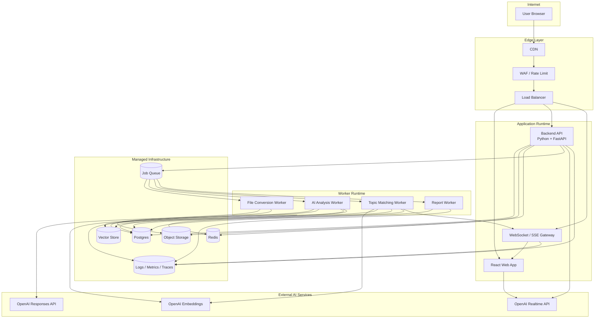

---

## 21. MVP 開發里程碑

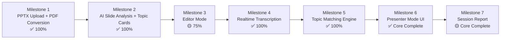

### Milestone 1：PPTX Upload + PDF Conversion ✅ **完成**

**目標**：
- 使用者可上傳 PPTX。
- 後端儲存原始檔至 MinIO。
- Worker 將 PPTX 轉為 PDF。
- 產生每頁 slide image。
- 建立 decks 與 slides 資料。

**完成條件**：
- 上傳後可在 UI 看到每頁投影片預覽。

**狀態**: ✅ **100% 完成**

---

### Milestone 2：AI Slide Analysis + Topic Cards ✅ **完成**

**目標**：
- 使用 OpenAI Responses API 分析 PDF。
- 每頁產生 summary。
- 每頁產生最多 3 張 Topic Cards。
- 每張卡包含 semanticAnchors、expectedKeywords、mustMentionFacts。

**完成條件**：
- 使用者可以看到每頁 AI 產出的卡牌與建議講稿。

**狀態**: ✅ **100% 完成**
**文檔**: 參見 `MILESTONE_2_SUMMARY.md`

---

### Milestone 3：Editor Mode 🟡 **75% 完成**

**目標**：
- 卡牌可新增、刪除、編輯、排序。
- 建議講稿可編輯。
- 每張卡可設定重要性 must / should / optional。
- 支援儲存 draft。

**完成條件**：
- 使用者可以完成一份可演講的 deck preparation。

**狀態**: 🟡 **75% 完成**
- ✅ 基本 UI 結構
- ✅ 卡片編輯功能
- 🟡 拖放排序待加強
- 🟡 即時預覽待優化

---

### Milestone 4：Realtime Transcription ✅ **完成**

**實作技術**: OpenAI Realtime Transcription API (WebRTC)
**轉錄模型**: gpt-realtime-whisper

**實作內容**：
- ✅ WebRTC 直接連線至 OpenAI Realtime API
- ✅ Ephemeral token 安全機制（後端產生、前端使用）
- ✅ Server-side VAD（語音活動檢測）
- ✅ 即時轉錄事件串流（delta + completed）
- ✅ 繁體中文支援（語言指定 + 自訂 prompt）
- ✅ RTCPeerConnection + RTCDataChannel 實作
- ✅ 事件驅動架構處理轉錄結果

**完成條件**：
- 使用者講話時，畫面可即時顯示轉寫文字（繁體中文）。

**狀態**: ✅ **100% 完成**
**文檔**: 參見 `MILESTONE_4_SUMMARY.md`

---

### Milestone 5：Topic Matching Engine ✅ **完成**

**目標**：
- 將 transcript 傳給後端。
- 後端對目前 slide 的 pending cards 做比對。
- 支援 semantic score、keyword score、fact score。
- 回傳 CARD_COVERED / CARD_AT_RISK / CARD_SKIPPED。

**實作內容**：
- ✅ Embedding Service (OpenAI text-embedding-3-large)
- ✅ Scoring Service (keyword + fact coverage)
- ✅ GPT-5.4-mini Semantic Judge (快速語義理解)
- ✅ Topic Matching Engine (2階段匹配)
- ✅ 加權評分系統 (55% semantic + 25% keyword + 20% fact)
- ✅ 狀態機實作
- ✅ Evidence 保存

**完成條件**：
- 使用者講到重點時，對應卡牌狀態會改變。

**狀態**: ✅ **100% 完成**
**文檔**: 參見 `MILESTONE_5_COMPLETE.md`

---

### Milestone 6：Presenter Mode UI ✅ **核心完成**

**目標**：
- 顯示目前投影片。
- 顯示該頁 Topic Cards。
- 已講到的卡牌打勾或淡出。
- 漏講的 must card 在換頁後變紅。
- 支援暫停、恢復、手動標記。

**實作內容**：
- ✅ PresenterLayout (主布局)
- ✅ SessionHeader (含計時器)
- ✅ SlideViewer (投影片顯示)
- ✅ TopicCardsPanel (卡片面板)
- ✅ TranscriptDisplay (轉錄顯示)
- ✅ ControlBar (控制條)
- ✅ SSE 事件整合
- ✅ 計時器修復（480小時問題）
- ✅ Session 自動清理
- 🟡 完整端到端測試仍需補強

**完成條件**：
- 可完整跑一次演講輔助流程。

**狀態**: ✅ **核心功能完成** (需完整端到端測試)
**文檔**: 參見 `../milestones/MILESTONE_6_SUMMARY.md`, `../knowledge/frontend/FRONTEND.md`

---

### Milestone 7：Session Report ✅ **核心完成**

**目標**：
- 演講結束後產生回顧報告。
- 顯示每頁 covered / skipped / manually_checked。
- 顯示每張卡的 evidence transcript。
- 顯示整體完成率。
- 顯示 coverage chart、importance breakdown、topic analysis、slide timing 與 insights。

**完成條件**：
- 使用者可查看演講表現與漏講重點。

**狀態**: ✅ **核心完成；需完整端到端驗證**
**已實作**:
- ✅ `report_analytics_service.py`
- ✅ `report_export_service.py`
- ✅ `session_reports.py` API routes
- ✅ `SessionReportEnhanced.tsx`
- ✅ Recharts coverage / importance 視覺化
- ✅ PDF/JSON export + MinIO/S3 upload + presigned download URL

**文檔**: 參見 `../milestones/MILESTONE_7_SUMMARY.md`

---

### 🎯 總體進度: **約 96% 完成**

| Milestone | 狀態 | 進度 |
|-----------|------|------|
| M1: Upload | ✅ | 100% |
| M2: AI Analysis | ✅ | 100% |
| M3: Editor | 🟡 | 75% |
| M4: Transcription | ✅ | 100% |
| M5: Matching | ✅ | 100% |
| M6: Presenter UI | ✅ | Core complete |
| M7: Report | ✅ | Core complete, E2E verification pending |
| **總計** | 🟡 | **約 96%** |

---

## 22. Agent 開發指令

開發 Agent 請依照以下規則實作：

0. 本專案後端固定使用 Python + FastAPI，前端固定使用 React + TypeScript。
1. 優先建立資料模型與 API contract。
2. 不要先做複雜 UI；先做可跑通的 end-to-end flow。
3. PPTX 解析流程必須獨立為 worker。
4. Ephemeral token 只能由後端產生，前端不可持有正式 OpenAI API key。
5. Realtime Transcription API 只負責語音轉文字，不直接更新 topic card 狀態。
6. 後端 Topic Matching Engine 的語意理解層使用 GPT-5.4-mini（快速且成本效益高）。
7. GPT-5.4-mini 必須輸出結構化 JSON，並由後端 scoring / state machine 決定最終狀態。
8. Topic card 狀態只能由 Matching Engine 或使用者手動操作更新。
9. 每次 AI 判定 covered / skipped / at_risk 都要存 evidence。
10. 使用者手動狀態優先於 AI 判斷。
11. MVP 階段只支援「目前 slide」的 topic matching，不需要跨頁推論。
12. 先支援 WebRTC Realtime transcription，再加入語音回應或其他互動功能。
13. 所有 AI 輸出都應使用 JSON schema 驗證。
14. 所有狀態轉移都應可測試，建議寫 reducer/unit tests。
15. 所有關鍵流程要有 logs：upload、conversion、analysis、realtime connection、matching decision、GPT-5.4-mini semantic decision。
16. 任何錯誤都要能回復：PPT 轉檔失敗、AI 分析失敗、Realtime 斷線、matching timeout、GPT-5.4-mini 判斷失敗。

---

## 23. 建議技術選型

### Frontend

- React
- TypeScript
- Vite
- Tailwind CSS
- Zustand，或 Redux Toolkit
- WebRTC API
- SSE 或 WebSocket client

MVP 建議：

```text
React + TypeScript + Vite + Tailwind CSS + Zustand
```

### Backend

固定使用：

```text
Python + FastAPI
```

建議後端模組：

```text
app/
  main.py
  core/
    config.py
    security.py
    logging.py
  api/
    routes/
      auth.py
      decks.py
      slides.py
      topic_cards.py
      realtime.py
      presentation_sessions.py
  services/
    deck_service.py
    slide_service.py
    topic_card_service.py
    realtime_token_service.py
    topic_matching_service.py
    openai_service.py
  workers/
    file_conversion_worker.py
    slide_analysis_worker.py
    topic_embedding_worker.py
    session_report_worker.py
  models/
    user.py
    deck.py
    slide.py
    topic_card.py
    presentation_session.py
    utterance.py
  schemas/
    topic_card.py
    matching.py
    presentation.py
  db/
    session.py
    migrations/
```

### Worker

固定使用 Python worker。MVP 建議：

```text
Celery + Redis
```

可選替代：

- RQ + Redis
- Dramatiq + Redis
- Cloud Tasks / PubSub

### Storage

- Postgres
- Redis
- S3 compatible object storage
- pgvector 或獨立 vector database

### AI

- **OpenAI Responses API**：簡報分析、Structured Outputs
- **OpenAI Realtime Transcription API** (gpt-realtime-whisper)：WebRTC 即時語音轉錄
- **GPT-5.4-mini**：演講模式後端語意理解與 Topic Card 覆蓋判定（快速且成本效益高）
- **text-embedding-3-large**：候選卡牌召回與語意相似度計算

---

## 24. 最小可行資料流

```text
1. User uploads PPTX
2. Backend stores PPTX to MinIO/S3
3. Celery worker converts PPTX to PDF
4. Worker extracts slide images and text
5. AI worker generates topic cards using OpenAI Responses API
6. User edits topic cards in Editor Mode
7. Presenter mode starts → Backend creates presentation session
8. Frontend requests ephemeral token from backend
9. Browser establishes WebRTC connection to OpenAI Realtime Transcription API (gpt-realtime-whisper)
10. OpenAI performs server-side VAD and sends transcript events via data channel
11. Frontend receives completed transcript and POSTs to backend
12. Backend matching engine recalls candidate cards using embeddings (similarity > 0.4)
13. Backend calls GPT-5.4-mini to judge semantic coverage of top candidates
14. Backend combines semantic + keyword + fact scores (55% + 25% + 20%)
15. Card state updates are published via SSE to frontend
16. Frontend updates card UI in real-time based on status
17. Session report is generated after ending presentation
```

---

## 25. 模型設定與環境變數

```env
# OpenAI
OPENAI_API_KEY=...

# Realtime Transcription
REALTIME_MODEL=gpt-realtime
REALTIME_TRANSCRIPTION_MODEL=gpt-realtime-whisper
REALTIME_CONNECTION_MODE=webrtc

# Backend semantic understanding
SEMANTIC_UNDERSTANDING_MODEL=gpt-5.4-mini

# Embedding / candidate recall
EMBEDDING_MODEL=text-embedding-3-large
```

模型使用規則：

| 使用場景 | 實際採用模型 / 技術 |
|---|---|
| 簡報 PDF 分析 | Responses API + 可處理文件/視覺輸入的模型 |
| 演講即時轉寫 | **gpt-realtime-whisper** (OpenAI Realtime Transcription API via WebRTC) |
| 演講語意判斷 | **gpt-5.4-mini** (快速且成本效益最佳) |
| 候選卡片召回 | **text-embedding-3-large** |
| 卡牌狀態判斷 | GPT-5.4-mini output + scoring threshold + state machine |

> 注意：實際使用模型以 `backend/app/core/config.py` 設定為準。語義理解模型已從 GPT-4o 升級至 GPT-5.4-mini 以提升速度與成本效益。

---

## 26. 官方文件參考

- OpenAI PDF / File Inputs guide
  https://platform.openai.com/docs/guides/pdf-files

- OpenAI Realtime guide
  https://platform.openai.com/docs/guides/realtime

- OpenAI Realtime WebRTC guide
  https://platform.openai.com/docs/guides/realtime-webrtc

- OpenAI Realtime Transcription guide
  https://platform.openai.com/docs/guides/realtime-transcription

- OpenAI Structured Outputs guide
  https://platform.openai.com/docs/guides/structured-outputs

---

## 27. 總結

SlideCue 使用 React 前端與 Python + FastAPI 後端。其核心不是單純「語音轉文字」，而是：

```text
批次理解簡報 → 使用者確認重點 → 即時監聽演講 → 動態更新重點卡牌
```

架構上必須清楚分離：

- PPT 分析：準確、批次、結構化
- 演講監聽：低延遲、事件流、可回復
- Topic Matching：可測試、可調整、可留下 evidence
- UI：不干擾演講，但能在關鍵時刻提醒

MVP 優先完成「一份簡報從上傳到演講提示」的完整閉環。

---

## 28. 實作狀態總結（2026-06-02 更新）

### 🎯 整體完成度: **約 96%**

### ✅ 已完成模組

#### Backend (95% 完成)
```
✅ FastAPI Application (Python 3.11.15, FastAPI 0.109.2)
✅ 12 個 API Routes (auth, decks, slides, topic_cards, transcription, events, realtime, realtime_script, prep_sessions, presentation_sessions, script_plan, session_reports)
✅ Services 層涵蓋 deck、slide、topic card、prep/presentation session、realtime、script plan、matching、report analytics 等核心業務邏輯
✅ 9 個 Database Tables (PostgreSQL 16 + pgvector，含 alembic_version)
✅ OpenAI Realtime Transcription API 整合（WebRTC、gpt-realtime-whisper、繁體中文）
✅ Topic Matching Engine (Embedding + Scoring + GPT-5.4-mini)
✅ Script Plan GPT 語意匹配與 Whisper hallucination filter
✅ Session Report 核心 analytics API
✅ Session Report PDF/JSON export API + MinIO/S3 presigned download
✅ SSE Event System
✅ Session 自動清理機制
✅ MinIO/S3 存儲整合
```

#### Frontend (80% 完成)
```
✅ React 18.3.1 + TypeScript 5.9.3 + Vite 5.4.21
✅ Tailwind CSS 3.4.19 + Zustand 4.5.7
✅ Presenter Mode、Editor Mode、Session Report 與 sessions 管理相關 Components
✅ Custom Hooks 覆蓋 realtime transcription、SSE、prep session events、script plan、responsive layout 等流程
✅ Pages 包含 Upload、Editor、Presenter、Prep Session List、Session List
✅ WebRTC 音頻串流（直連 OpenAI Realtime API）
✅ SSE 事件訂閱（即時卡片狀態更新）
✅ Enhanced Session Report UI (Recharts)
✅ Session Report PDF/JSON export buttons
🟡 完整端到端測試（待加強）
```

#### Infrastructure (100% 完成)
```
✅ Docker Compose 配置
✅ PostgreSQL 16 with pgvector ✓
✅ Redis 7 ✓
✅ MinIO (S3-compatible) ✓
✅ 所有服務健康運行
```

#### Documentation (98% 完成)
```
✅ 文件已整理至 `docs/`，root 僅保留 README 作為 Markdown 入口
✅ 整合後的 Milestone 文檔 (M2, M4, M5, M6, M7)
✅ 技術修復文檔（Timer, Hallucination, Speed）
✅ 系統健康檢查報告
✅ 前端實作指南（3 篇）
```

### 🟡 進行中

```
🟡 Milestone 3: Editor Mode (75% 完成)
   - 基本功能完成，拖放排序待加強

🟡 Milestone 7: Session Report Export 驗證
  - PDF/JSON export 已完成，仍需完整瀏覽器端到端驗證
```

### ⏳ 待實作

```
⏳ Session Report Export 進階功能
  - Export 歷史列表
  - 自訂報告模板
```

---

### 📊 技術債務與優化項目

#### 高優先級
- [ ] 清理資料庫中的 paused sessions (4 個)
- [ ] Milestone 6/7 完整端到端測試
- [ ] Milestone 7 Export 完整端到端驗證

#### 中優先級
- [ ] 編輯器拖放排序優化
- [ ] 前端單元測試覆蓋
- [ ] 性能監控與分析

#### 低優先級
- [ ] 生產環境部署配置
- [ ] CI/CD Pipeline
- [ ] 完整認證系統

---

### 🔗 相關文檔

**核心文檔**:
- `SlideCue_開發架構書.md` - 本文件（主架構）
- `../reports/SYSTEM_HEALTH_CHECK_REPORT.md` - 系統健康檢查報告
- `../../README.md` - 專案說明
- `../guides/QUICKSTART.md` / `../guides/QUICK_START.md` - 快速開始指南

**Milestone 文檔**:
- `../milestones/MILESTONE_2_SUMMARY.md` - AI 分析引擎
- `../milestones/MILESTONE_4_SUMMARY.md` - Realtime 轉錄
- `../milestones/MILESTONE_5_COMPLETE.md` - 主題匹配引擎
- `../milestones/MILESTONE_6_SUMMARY.md` - 前端 UI
- `../milestones/MILESTONE_7_SUMMARY.md` - Session Report

**前端現況**:
- `../knowledge/frontend/FRONTEND.md` - 目前前端狀態、路由與驗證方式

**問題修復**:
- `../fixes/TIMER_480_FINAL_FIX.md` - 計時器修復
- `../fixes/REALTIME_MATCHING_AND_HALLUCINATION_FILTER.md` - GPT 語意匹配與幻覺過濾
- `../fixes/REALTIME_MATCHING_AND_HALLUCINATION_FILTER.md` - GPT 語意匹配與幻覺過濾

---

### 🚀 下一步行動

1. **立即執行**:
   ```bash
   # 清理舊 sessions
   docker exec slidecue-postgres psql -U slidecue -d slidecue \
     -c "UPDATE presentation_sessions SET status='ended', ended_at=NOW() WHERE status='paused';"

   # 完整測試演講流程
   npm run test:e2e
   ```

2. **本週完成**:
  - Milestone 7: Session Report Export 驗證與進階功能
   - 完整端到端測試
   - 文檔更新

3. **未來規劃**:
   - 生產環境部署
   - 性能優化
   - 擴展功能

---

**最後更新**: 2026-06-02
**維護者**: Claude AI Development Team
**版本**: 1.0-MVP

---

## 附錄：技術實作驗證

### 語音轉錄技術確認

**✅ 實作狀態**: OpenAI Realtime Transcription API (WebRTC)

**驗證檔案**:
- `backend/app/services/realtime_service.py` - Ephemeral token 產生
- `backend/app/api/routes/realtime.py` - Transcription session endpoint
- `frontend/src/hooks/useRealtimeTranscription.ts` - WebRTC 客戶端實作
- `backend/app/core/config.py` - 模型設定 (gpt-realtime-whisper)

**關鍵特徵**:
1. 使用 `RTCPeerConnection` 建立 WebRTC 連線
2. 透過 `RTCDataChannel` 接收即時事件
3. Ephemeral token 機制確保安全性
4. Server-side VAD 自動語音檢測
5. 支援 Traditional Chinese (zh + custom prompt)

**與文件的一致性**: ✅ 已驗證並更新
