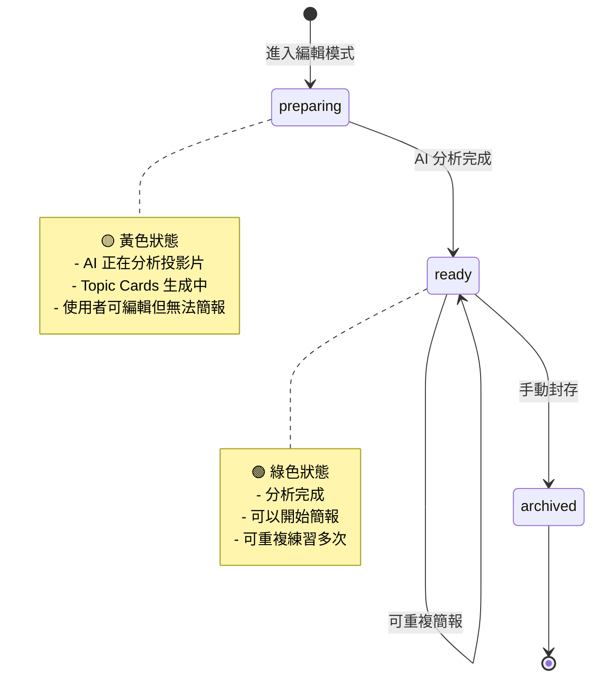

# PrepSession 功能文檔

**最後更新**: 2026-05-26  
**實作狀態**: ✅ 已完成

## 概述

PrepSession（準備模式）是 SlideCue 的核心架構改進，將「準備階段」與「實際簡報」分離為兩層架構。

### 核心概念

```
Deck（投影片檔案）
  └─ PrepSession（準備模式單位）
       └─ PresentationSession（簡報記錄）x N
```

**優點**：
- 一個準備單位可以重複練習多次
- 每次簡報記錄獨立保存
- 便於追蹤練習進度和比較表現
- 清晰的狀態管理（preparing → ready）

## 架構設計

### 資料模型

#### PrepSession (準備模式)
```typescript
interface PrepSession {
  id: string;
  deckId: string;
  userId: string;
  title?: string;                    // 可自訂名稱
  status: 'preparing' | 'ready' | 'archived';
  createdAt: string;
  updatedAt: string;
  presentationSessionsCount: number; // 簡報次數
}
```

#### PresentationSession (簡報記錄)
```typescript
interface PresentationSession {
  id: string;
  prepSessionId: string;  // 隸屬於哪個 PrepSession
  deckId: string;
  userId: string;
  status: 'idle' | 'presenting' | 'ended' | ...;
  currentSlideId?: string;
  startedAt?: string;
  endedAt?: string;
  createdAt: string;
}
```

### 狀態機



## 實作細節

### 1. 自動創建 PrepSession

**前端** (`EditorPage.tsx`)：
```typescript
useEffect(() => {
  const createPrepSession = async () => {
    try {
      const deck = await deckApi.getDeck(deckId);
      await prepSessionsAPI.createPrepSession({
        deckId: deckId,
        title: `${deck.title} - Prep Session`
      });
    } catch (error) {
      // 如果已存在則忽略
      console.debug('PrepSession creation skipped:', error);
    }
  };
  
  createPrepSession();
}, [deckId]);
```

**後端** (`prep_session_service.py`)：
```python
def create_prep_session(
    self, db: Session, user_id: str, prep_session_data: PrepSessionCreate
) -> PrepSession:
    deck = db.query(Deck).filter(Deck.id == prep_session_data.deckId).first()
    
    # 根據 Deck 狀態決定 PrepSession 初始狀態
    prep_session_status = "ready" if deck.status == "analyzed" else "preparing"
    
    prep_session = PrepSession(
        id=f"prep_{uuid.uuid4().hex[:12]}",
        deck_id=prep_session_data.deckId,
        user_id=user_id,
        title=prep_session_data.title,
        status=prep_session_status,
        created_at=datetime.utcnow(),
        updated_at=datetime.utcnow()
    )
    
    db.add(prep_session)
    db.commit()
    return prep_session
```

### 2. 自動狀態更新

**後端** (`slide_analysis_worker.py`)：
```python
@celery_app.task(name="analyze_slides")
def analyze_slides(self, deck_id: str):
    # ... 分析投影片、生成 Topic Cards ...
    
    # 更新 Deck 狀態
    deck.status = "analyzed"
    db.commit()
    
    # 自動更新相關 PrepSession 為 ready
    prep_sessions = db.query(PrepSession).filter(
        PrepSession.deck_id == deck_id,
        PrepSession.status == "preparing"
    ).all()
    
    for prep in prep_sessions:
        prep.status = "ready"
        prep.updated_at = datetime.utcnow()
    
    db.commit()
    
    logger.info(f"✅ Updated {len(prep_sessions)} PrepSession(s) to 'ready'")
```

### 3. 開始簡報

當使用者開始簡報時，在 PrepSession 下創建新的 PresentationSession：

```python
# PresenterPage.tsx
const handleStartPresentation = async () => {
  // 1. 找到或創建 PrepSession
  const prepSession = await findOrCreatePrepSession(deckId);
  
  // 2. 在 PrepSession 下創建 PresentationSession
  const session = await prepSessionsAPI.createPresentationSessionForPrep(
    prepSession.id
  );
  
  // 3. 開始簡報
  navigate(`/presenter/${deckId}?sessionId=${session.id}`);
};
```

## API 端點

### PrepSession 管理

```http
# 列出所有 PrepSession
GET /api/prep-sessions/
Query: status, deckId, limit, offset, sortBy, order

# 創建 PrepSession
POST /api/prep-sessions/
Body: { deckId, title? }

# 取得單個 PrepSession
GET /api/prep-sessions/{prep_session_id}

# 更新 PrepSession
PATCH /api/prep-sessions/{prep_session_id}
Body: { title?, status? }

# 刪除 PrepSession（cascade 刪除所有 PresentationSession）
DELETE /api/prep-sessions/{prep_session_id}

# 刪除所有 PrepSession
DELETE /api/prep-sessions/all
```

### PresentationSession 管理

```http
# 列出 PrepSession 下的所有 PresentationSession
GET /api/prep-sessions/{prep_session_id}/presentation-sessions

# 在 PrepSession 下創建新的 PresentationSession
POST /api/prep-sessions/{prep_session_id}/presentation-sessions

# 傳統方式（需要提供 prepSessionId）
POST /api/presentation-sessions/
Body: { prepSessionId, deckId }
```

## 前端頁面

### PrepSession 管理頁面 (`/prep-sessions`)

**功能**：
- 顯示所有 PrepSession
- 可展開查看每個 PrepSession 下的所有 PresentationSession
- 狀態視覺化（preparing 🟡, ready 🟢）
- 統計資料展示
- 刪除功能（單個/全部）

**組件**：
```typescript
// PrepSessionListPage.tsx
- PrepSessionStats: 統計資料
- PrepSessionTable: 可展開的表格
  - PrepSessionRow: 單個 PrepSession
    - PresentationSessionList: 展開後顯示簡報記錄
```

**UI 特性**：
- 可展開/收合的行
- 顏色編碼狀態 badge
- 點擊查看簡報詳情
- 雙擊確認刪除
- 刪除所有需輸入 "DELETE ALL" 確認

## 資料庫 Schema

```sql
-- PrepSession 表
CREATE TABLE prep_sessions (
  id TEXT PRIMARY KEY,
  deck_id TEXT NOT NULL REFERENCES decks(id) ON DELETE CASCADE,
  user_id TEXT NOT NULL REFERENCES users(id),
  title TEXT,
  status TEXT NOT NULL DEFAULT 'preparing',
  created_at TIMESTAMPTZ NOT NULL DEFAULT now(),
  updated_at TIMESTAMPTZ NOT NULL DEFAULT now()
);

-- PresentationSession 表（新增 prep_session_id）
CREATE TABLE presentation_sessions (
  id TEXT PRIMARY KEY,
  prep_session_id TEXT NOT NULL REFERENCES prep_sessions(id) ON DELETE CASCADE,
  deck_id TEXT NOT NULL REFERENCES decks(id),
  user_id TEXT NOT NULL REFERENCES users(id),
  status TEXT NOT NULL,
  current_slide_id TEXT,
  started_at TIMESTAMPTZ,
  ended_at TIMESTAMPTZ,
  created_at TIMESTAMPTZ NOT NULL DEFAULT now()
);

-- 索引
CREATE INDEX idx_prep_sessions_deck ON prep_sessions(deck_id);
CREATE INDEX idx_prep_sessions_user ON prep_sessions(user_id);
CREATE INDEX idx_prep_sessions_status ON prep_sessions(status);
CREATE INDEX idx_presentation_sessions_prep ON presentation_sessions(prep_session_id);
```

## 資料遷移

**Alembic Migration**: `e3ab8962e5b9_add_prep_sessions_table.py`

```python
def upgrade():
    # 1. 創建 prep_sessions 表
    op.create_table('prep_sessions', ...)
    
    # 2. 添加 prep_session_id 到 presentation_sessions
    op.add_column('presentation_sessions',
        sa.Column('prep_session_id', sa.String(), nullable=True))
    
    # 3. 資料遷移：為每個 Deck 創建一個 PrepSession
    conn = op.get_bind()
    decks = conn.execute("SELECT id, user_id, title FROM decks WHERE status = 'analyzed'")
    
    for deck in decks:
        prep_id = f"prep_{uuid.uuid4().hex[:12]}"
        conn.execute(
            "INSERT INTO prep_sessions (id, deck_id, user_id, title, status) "
            "VALUES (%s, %s, %s, %s, 'ready')",
            (prep_id, deck.id, deck.user_id, f"{deck.title} - Prep Session")
        )
        
        # 關聯現有的 PresentationSessions
        conn.execute(
            "UPDATE presentation_sessions SET prep_session_id = %s WHERE deck_id = %s",
            (prep_id, deck.id)
        )
    
    # 4. 設置外鍵約束
    op.alter_column('presentation_sessions', 'prep_session_id', nullable=False)
```

## 測試流程

### 1. 上傳新投影片
```bash
# 預期：Deck 開始處理
curl -X POST http://localhost:8001/api/decks/upload
```

### 2. 進入編輯模式
```bash
# 預期：自動創建 PrepSession（status: preparing）
GET /editor/{deckId}
```

### 3. 檢查 PrepSession 狀態
```bash
curl http://localhost:8001/api/prep-sessions/
# 預期：看到新的 PrepSession，status: "preparing"
```

### 4. 等待分析完成
```bash
# Worker 完成分析後
# 預期：PrepSession status 自動更新為 "ready"
```

### 5. 開始簡報（多次）
```bash
# 第一次簡報
POST /api/prep-sessions/{prep_id}/presentation-sessions

# 第二次簡報（同一個 PrepSession）
POST /api/prep-sessions/{prep_id}/presentation-sessions

# 預期：同一個 PrepSession 下有 2 個 PresentationSession
```

## 故障排查

### PrepSession 未自動創建
**問題**：進入編輯模式後沒有創建 PrepSession  
**檢查**：
```bash
# 查看前端控制台錯誤
# 檢查後端日誌
tail -f /tmp/slidecue-backend.log

# 手動創建測試
curl -X POST http://localhost:8001/api/prep-sessions/ \
  -H "Content-Type: application/json" \
  -d '{"deckId": "deck_xxx"}'
```

### 狀態未自動更新為 ready
**問題**：分析完成後 PrepSession 仍是 preparing  
**檢查**：
```bash
# 檢查 Celery worker 日誌
tail -f /tmp/slidecue-celery.log

# 檢查 Deck 狀態
curl http://localhost:8001/api/decks/{deckId}

# 手動更新測試
docker exec slidecue-postgres psql -U slidecue -d slidecue \
  -c "UPDATE prep_sessions SET status = 'ready' WHERE status = 'preparing';"
```

### Celery Worker 未啟動
**問題**：狀態更新邏輯未執行  
**解決**：
```bash
# 重啟 Celery worker
pkill -9 -f "celery.*app.workers.celery_app"
cd backend
source venv/bin/activate
export PATH="/opt/homebrew/bin:$PATH"
celery -A app.workers.celery_app worker --loglevel=info
```

## 已知限制

1. **單用戶模式**：目前使用 `user_default`，多用戶支援待實作
2. **沒有通知機制**：狀態更新需手動刷新頁面（可改用 SSE）
3. **封存功能**：archived 狀態已定義但 UI 未實作管理介面

## 未來改進

- [ ] SSE 事件通知狀態變更
- [ ] PrepSession 標題編輯 UI
- [ ] 封存/恢復功能
- [ ] 簡報比較功能（比較同一 PrepSession 下的多次簡報）
- [ ] 統計圖表（練習次數、改進趨勢）
- [ ] 批量操作（批量封存/刪除）

## 參考資料

- [SlideCue 開發架構書](../../architecture/SlideCue_開發架構書.md)
- Migration: `backend/alembic/versions/e3ab8962e5b9_add_prep_sessions_table.py`
- Backend Service: `backend/app/services/prep_session_service.py`
- Frontend API: `frontend/src/api/prepSessions.ts`
- Frontend Page: `frontend/src/routes/PrepSessionListPage.tsx`
